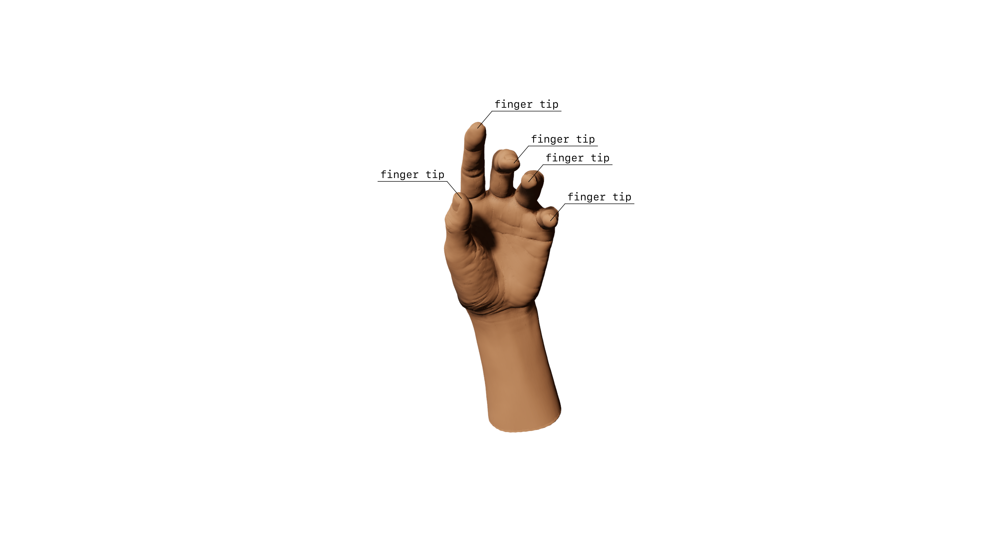
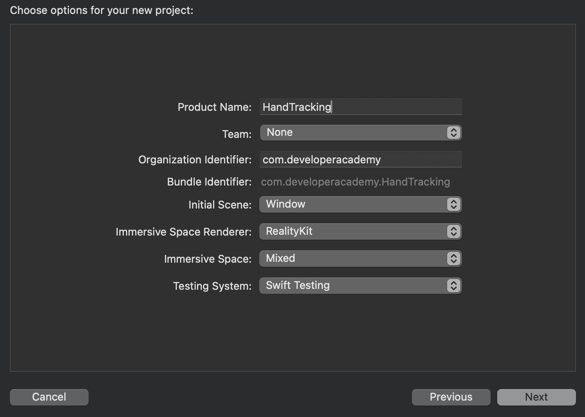

## Introduction
When it comes to interaction with the system, visionOS is light-years beyond any other device. Suddenly, Apple allowed us to create a “Minority Report Sci-fi like UI”, and Tom Cruise is not the only one that can touch the air and control a whole system.



But, for now, let's get back to reality and see what we can do when starting a project from scratch!

--- 

## TLDR   
- System gestures are added using `.gesture` view modifier such as on an iPhone app;   
- RealityView entities `.components` must contains `InputTargetComponent` and `CollisionComponent` in order to be used as a gesture target.   

--- 

## Outline   
- What’s ready to use?   
- TapGesture and Entity Targeting   
- Other Gestures: DragGesture, RotationGesture and etc.   
- What’s next?   

--- 

## Project.swift   
This article was written using these specifications:   

```swift
struct Project {
  var macOSVersion: Version = .macOS("15.1.1") // Sequoia
  var visionOSVersion: Version = .visionOS("2.1")
  var xcodeVersion: Version = .xcode("16.1")
  var swiftVersion: Version = .swift("6.0")
}

```
--- 
## What's ready to use?   
Let's go straight to the point, and create a new visionOS App.   

    

The visionOS has a set of built-in gestures that we are already familiar with, such as, tapping and dragging. Using the is as easy as it is on iOS apps.   
Upon creation, your `ImmersiveView` should look like the code below:   

```swift
import SwiftUI
import RealityKit
import RealityKitContent

struct ImmersiveView: View {

    var body: some View {
        RealityView { content in
            if let immersiveContentEntity = try? await Entity(named: "Immersive", in: realityKitContentBundle) {
                content.add(immersiveContentEntity)

            }
        }
    }
}

#Preview(immersionStyle: .mixed) {
    ImmersiveView()
        .environment(AppModel())
}

```

Let’s modify our `RealityView` content to use a procedural `ModelEntity`, that is, a 3D object made programatically.   

```swift
let mesh = MeshResource.generateBot(size: 0.3, cornerRadius: 0.03)
let material = SinpleMaterial(color: .white, isMetallic: false)
let model = ModelEntity(mesh: mesh, material: material)

model.transform.translation = [0, 1, -2]

content.add(model)
```

Now, to add a simple tap gesture we are going to use the `.gesture` view modifier on the `RealityView`:   

```swift
.gesture(
 TapGesture()
  .onEnded {
   print("Tap!!!")
  }
)
```

In order to make our `ModelEntity` a target of the `TapGesture`, that is, to recognize the gesture when we tap the model, we have to add `CollisionComponent` and `InputTargetComponent` to the `ModelEntity`.   

```swift
let collisionComponent = CollisionComponent(shapes: [
              .generateBox(size: [0.3, 0.3, 0.3])
             ])
let inputComponent = InputTargetComponent()

model.components.set(collisionComponent)
model.components.set(inputComponent)

// this whole code is inside the RealityView content body, but you could have this outside the body as well
```

The way that the code is, the TapGesture does not give us any meaningful information besides "a tap occurred”. But Apple thought about it, and we have tree view modifiers that help up with it: `.targetedToAnyEntity()`, `.targetedToEntity(\_ entity: Entity)`, `.targetedToEntity(where: QueryPredicate<entity>)`. The use of them is quite similar and its names follows the default Apple-descriptiveness. So, let's give it a try!   
Fist, let me give a very creative name for our box:   

```swift
model.name = "Box" // right below the instance
```

And change a little bit here:   

```swift
.gesture(
 TapGesture()
  .targetedToAnyEntity() // this line
    .onEnded { target in // gives us this guy
   print(target.entity.name) // so we ca do this
  }
)
```

In this example, the `TapGesture` will be triggered when any entity receives the tap, because `.targetedToAnyEntity` was used. If you want to add the gesture to a specific entity, you can use `.targetedToEntity(Entity)` or `.targetedToEntity(where: QueryPredicate<entity>)`.   

### DragGesture, RotationGesture & etc   
Gestures that produces more information, such as DragGesture, are tracked using the `.onChanged` method. When combined with `.targetedToAnyEntity`, or similar, you will have access to a set of functions defined in the protocol `RealityCoordinateSpaceConverting`.   

```swift
.gesture(
 DragGesture()
  .targetedToAnyEntity()
  .onChanged { value in
   model.position = value.convert(value.location3D,
                   from: .local, to: value.entity.parent!)
  }
)
```

**Remember:** For entity targeting to work, entities must have a `CollisionComponent` and an `InputTargetComponent`!   
If you'd like to learn more on how to transform **RealityKit** entities using gestures checkout this Apple Developer guide:   
[Transforming RealityKit entities using gestures \| Apple Developer Documentation](https://developer.apple.com/documentation/realitykit/transforming-realitykit-entities-with-gestures)   

## What's next?   
You might be wondering “what if I want to create a game where I can make some hand gestures like Doctor Strange and open a portal tough?”, well, you might no be wondering exactly this, but picture that 🤩! Unfortunately, visionOS still doesn't allow us to do so, but it gives us the tools to make it: the ARKit H`andTrackingProvider.`   
Using this provider, we will have access to the position of our hand joints, thus, allowing us to create custom gestures!   
In the next *Short* we will learn how to use the data provided by the `HandTrackingProvider` to update our `RealityView` based on the position of our joints.   
See ya!   
   
