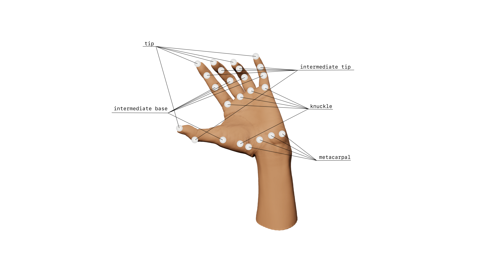
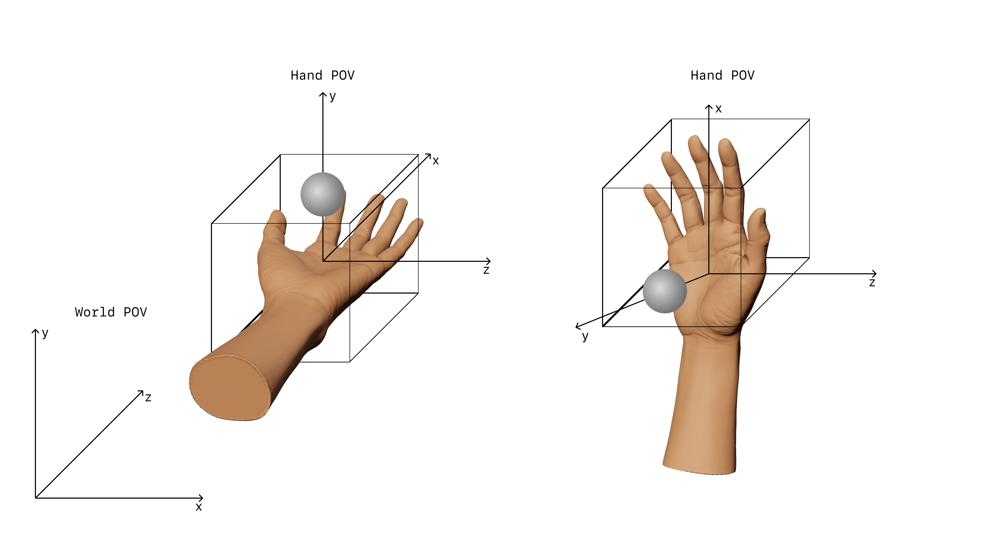

## Introduction
This is the most important *Short* of this series. Today, you are going to build the foundation of our system, and understand the building blocks of the hand tracking system that Apple provides to us.   

After finish it, you will be abale to create all kinds of hand gestures if you are creative enough. So, let's see what is next!   

--- 

## TLDR   
- ARKit’s `ARKitSession` is similar to ARKit's `ARSession`, but is specific to visionOS;   
- `Info.plist` must contains the `NSHandsTrackingUsageDescription` key;   
- To start the provider you call the `ARKitSession` method `.run([provider])`, than, you receive the updates on the provider's async sequence `.anchorUpdates`.   
- Custom gestures are recognized based on a ARKit's `HandAnchor`, where you get the positions of the joints on either hands. These anchors are posted by the provider on it's async sequence property `.anchorUpdates`;   
 
--- 
   
## Outline   
- Session and Provider   
- Authorization   
- Handling Updates   

--- 
   
## Project.swift   
This article was written using these specifications:   

```swift
struct Project {
  var macOSVersion: Version = .macOS("15.1.1") // Sequoia
  var visionOSVersion: Version = .visionOS("2.1")
  var xcodeVersion: Version = .xcode("16.1")
  var swiftVersion: Version = .swift("6.0")
}
```
--- 

## Session and Provider   
If you have already used ARKit you might have already had to set up a session and request the user authorization to work with ARKit. On VisionPro, the set up is basically the same, bu the class that we gonna use it's not the same, but very alike. Apple have developed a whole new subsystem in order to work with a bunch of cameras and sensors on VisionPro.   
While on iOS we use `ARSession` to create a ARKit's session, on visionOS we gonna use `ARKitSession`.   
Let's dive in!   
The two main building blocks of the system are the `ARKitSession` and the `HandTrackingProvider`.   

```swift
@Observable
class HandTracker {
	private let session: ARKitSession
	private let provider: HandTrackingProvider

	init(session: ARKitSession = .init(),
		 provider: HandTrackingProvider = .init()) {
		self.session = session
		self.provider = provider
	}

	func track() async {
		do {
        	try await self.session.run([provider])
         } catch {
        	print("ARKitSession error:", error)
    	}
	}
}
```

visioOS came with a set of providers defined by the protocol [`DataProvider`, such](https://developer.apple.com/documentation/arkit/dataprovider) as `[HandTrackingProvider](https://developer.apple.com/documentation/arkit/handtrackingprovider)`, `[WorldTrackingProvider,](https://developer.apple.com/documentation/arkit/worldtrackingprovider)` and `[PlaneDetectionProvider](https://developer.apple.com/documentation/arkit/planedetectionprovider)`. The provide live data based on what you want to observe.   
The code above is pretty straight foward. You create an instace of `ARKitSession`, and an instace of HandTrackingProvider, then you call session.run([provider]) et voilà! Hand tracking is almost ready. Hold a second before actually run.   

## Authorization   
As expected, we can't simply start to track every hand movement our user does while using VisionPro. But, to request authorization is as simply as always. We just have to:   
1. Add `NSHandsTrackingUsageDescription` key (and a description) to the Info.plist;   
2. Call `await session.requestAuthorization(for: [.handTracking])`;   
   
So, let's create a function on our tracker
   
```swift
func requestAuthorization() async {
	_ = await session.requestAuthorization(for: [.handTracking])
}
```

And call it on our first window at the app root.   

```swift
ContentView()
	.task {
		await tracker.requestAuthorization()
	}

```

After running it you might see… nothing (actually, just the authorization prompt).   
# Handling Updates   
Finally we got to the interesting part!   
What exactly the `HandTrackingProvider` provides us? The answer is `HandAnchors`. Each anchor will track the chirality, left or right, and a skeleton, the hand joints. Base on the position of each joint, `.transform` property, we can create any hand gesture imaginable.   
The joints tracked by ARKit are:   
- 5 finger tips;   
- 5 intermadiate tip joints;   
- 5 intermadiate base joints;   
- 5 knuckles;   
- 4 metacarpals (the thumb doesn't have this one);   
   
The cover image of this *Short* shows exactly where these joints are.   
Now, let's replicate the cover image but in an app, and in real time!   
First, our tracker needs a way to map a ModelEntity to each joint:   

```swift
private var leftHandJoints: [HandSkeleton.JointName: ModelEntity] = [:]
private var rightHandJoints: [HandSkeleton.JointName: ModelEntity] = [:]

@MainActor
    public func addToContent(_ content: RealityViewContent) {
        for joint in HandSkeleton.JointName.allCases {
            if let oldModel = leftHandJoints[joint] {
                content.remove(oldModel)
            }

            let newModel = ModelEntity.createSphere()
            leftHandJoints[joint] = newModel
            content.add(newModel)
        }

        for joint in HandSkeleton.JointName.allCases {
            if let oldModel = rightHandJoints[joint] {
                content.remove(oldModel)
            }

            let newModel = ModelEntity.createSphere()
            rightHandJoints[joint] = newModel
            content.add(newModel)
        }
    }

```

We gonna use the `addTocontet` method later to add the spheres in the `RealityView`.   

--- 

Let's create a  `extension` of `ModelEntity` to create these spheres.   

```swift
import SwiftUI
import RealityKit

public extension ModelEntity {
    static func createSphere(radius: Float = 0.005, hexColor: String = "FAF9F6") -> ModelEntity {
        let simpleMaterial = SimpleMaterial(color: UIColor(hex: hexColor), isMetallic: false)
        return ModelEntity(mesh: .generateSphere(radius: radius), materials: [simpleMaterial])
    }
}

extension SIMD3: Sendable {}

public extension UIColor {
    convenience init(hex: String) {
        let scanner = Scanner(string: hex)
        var color: UInt64 = 0
        scanner.scanHexInt64(&color)
        let r = CGFloat((color & 0xFF0000) >> 16) / 255.0
        let g = CGFloat((color & 0x00FF00) >> 8) / 255.0
        let b = CGFloat(color & 0x0000FF) / 255.0
        self.init(red: r, green: g, blue: b, alpha: 1.0)
    }
}

```
--- 
   
The `HandTrackingProvider` has a property called `anchorUpdates`, that is a [asynchronous sequence](https://developer.apple.com/documentation/swift/asyncsequence) of HandAnchors. Right after we run the provider, we can start to loop through this async sequence.   

```swift
func track() async {
	do {
		try await self.session.run([provider])

		// Awating updates!!!
		for await update in provider.anchorUpdates {
			await handleUpdate(update)
		}

	} catch {
		print("ARKitSession error:", error)
	}
}
```

To handle the updates we gonna track the latest `HandAnchor` for either hands and, based on the position of each joint tracked in the skeleton, updated the sphere (`ModelEntity`) position.   
   
```swift
private(set) var leftHandAnchor: HandAnchor?
private(set) var rightHandAnchor: HandAnchor?

private func handleUpdate(_ update: AnchorUpdate<HandAnchor>) async {
	switch update.event {
	case .updated:
		let anchor = update.anchor
		guard anchor.isTracked else { return }

		if anchor.chirality == .left {
			leftHandAnchor = anchor
		} else {
			rightHandAnchor = anchor
		}
	default:
		break
	}
}
```

We're almost done with the HandTracker implementation!   
Jumping back in the `ImersiveView`, try to guess what we need to do with the RealityView 👀.   
Remember, we want to recreate the cover image experience. There, we have some spheres, one for each joint, that are were created and persisted by the tracker in the `leftHandJoints` and `rightHandJoints`…   
If you guessed add the spheres to the content and update their position based on the anchors, you are right! 😌   
The RealityView inside it must be updated to:   

```swift
RealityView { content in
	tracker.addToContent(content)
} update: { content in
	tracker.updateModels()
}
.task {
	await tracker.track()
}
.upperLimbVisibility(.hidden)
```

Try to use the `.upperLimbVisibility(.visible)` to see the difference.   
And last but not least, back to the tracker, the function responsible to update the models position:   
```swift
func updateModels() {
	guard let leftHandAnchor, leftHandAnchor.isTracked,
		  let rightHandAnchor, rightHandAnchor.isTracked
	else { return }

	for (jointName, model) in leftHandJoints {
		guard let skeleton = leftHandAnchor.handSkeleton?.joint(jointName),
			  skeleton.isTracked
		else { continue }

		let transform = matrix_multiply(leftHandAnchor.originFromAnchorTransform, skeleton.anchorFromJointTransform)
		model.transform = Transform(matrix: transform)
	}

	for (jointName, model) in rightHandJoints {
		guard let skeleton = rightHandAnchor.handSkeleton?.joint(jointName),
			  skeleton.isTracked
		else { continue }

		let transform = matrix_multiply(rightHandAnchor.originFromAnchorTransform, skeleton.anchorFromJointTransform)
		model.transform = Transform(matrix: transform)
	}
}
```

Yes, pretty huge. But, in "short":    
1. Loop through every joint, on the left hand;   
2. Retrieve the `HandSkeleton.Joint` based on the joint name;   
3. Multiply the `originFromAnchorTransform` of the latest left hand anchor by the `anchorFromJointTransform` of the joint skeleton retrieved;   
4. Update the `ModelEntity` `.trasform` property of the itereation;   
5. Do the same with the right hand joints;   
   
Now, just run your app and enjoy your work!   

### Why do we neet to multiply theses properties?   
You can see this multiplication as a translation between the specific hand 3D space coordinates, `skeleton.anchorFromJointTransform`, to the world 3D space coordinates, `rightHandAnchor.originFromAnchorTransform`.   
That might have not helped that much, right? 🤔   
Let's think about it in terms of POV (point of view).   
Lay both your hands in front of you and try to imagine 3 arrows coming out of the center of your palm. One arrow, goint to the front, is the X axis, another one going to the left, the Z axis, and another one going up, the Y axis. That is the `skeleton.anchorFromJointTransform`.   
In a later *Short* I am going to explain why I placed the arrow like this.   
Let's also say that the world has arrows too. The arrow Y is pointing up, the Z arrow is pointing forward, and the X arrow e pointing left. That is the `rightHandAnchor.originFromAnchorTransform`.   
Now, imagine two balls, one at each hand, placed above your hands on the Y axis going up and down. Then, raise your right hand in a way that the palm of your hand will be facing you. The Y axis is now pointing at you. Thus, the ball is also pointed at you face. The ball "stick" to the axis that is "sticked" to your hand.   
From the world POV, the ball was going up and down on the Y axis, now it is going forward and backward on the Z axis.   
    

## What is next?   
Well, we didn't create any gesture today, but we pave the way to do so!   
Now, we have to step a litte bit more into math to extract meaninful information about our hands.   
If you want to try by yourself, ponder about what two points in a space can represent. Which properties can we mesure between those two points? Can we create a line? Or two lines? Mesure the distance? Angles? Direction?   
Keep asking more questions but do not forget to try and see what you are capable of! And remeber two heads are better than one.   
In the next Short I'll answer some of these questions for you. See ya!   
