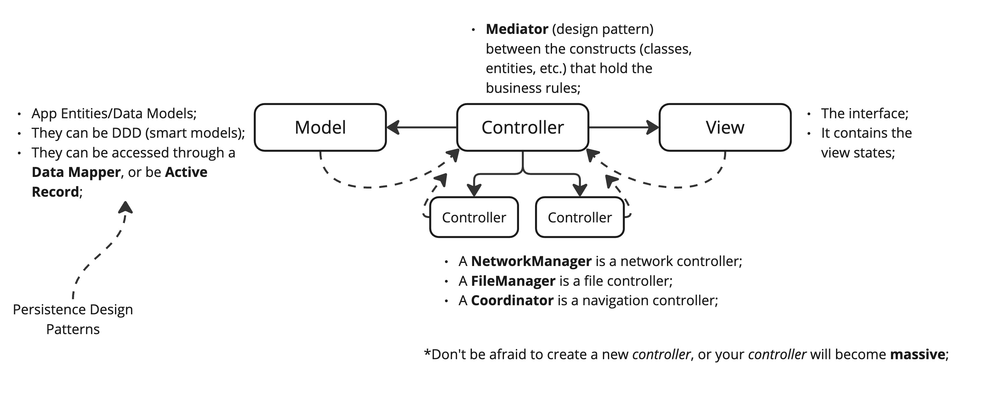

## Description

A comprehensive diagram on how the MVC architecture works and why you might be using it wrong.

> The image above is just a preview of the full diagram.

- The Controller tend to become massive due to poor separation of concerns, breaking the SRP (single resposibility principle), thus the bad fame of the arch.

- **Main Take**: Do not be afraid of creating new `classes`, `actors`, `structs` to better separate the business rules of your system.

## Download
Donwload the full diagram on the following link: [PDF](mvc.pdf)
