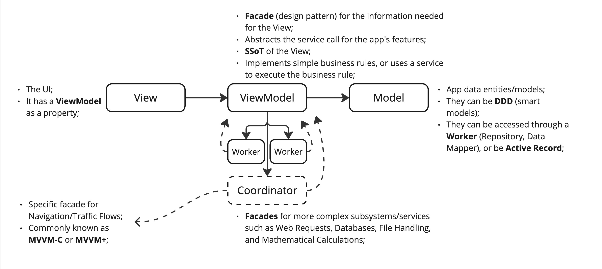

## Description

A comprehensive diagram on how the MVVM architecture works and why you might be using it wrong.

> The image above is just a preview of the full diagram.

- Be carefull, it might fall on the same error as **MVC**, a massive _ViewModel_ due to poor separation of concerns, breaking the **SRP** (single resposibility principle);
- It might be a good choice when working with **Reactive** frameworks, just keep a good managements of your **SSoT** (single source of truth);
- **Main Take**: Treat the ViewModel as just the entry point of one or more subsystems, not the implementation of thoses subsystems;

## Download
Donwload the full diagram on the following link: [PDF](mvvm.pdf)
