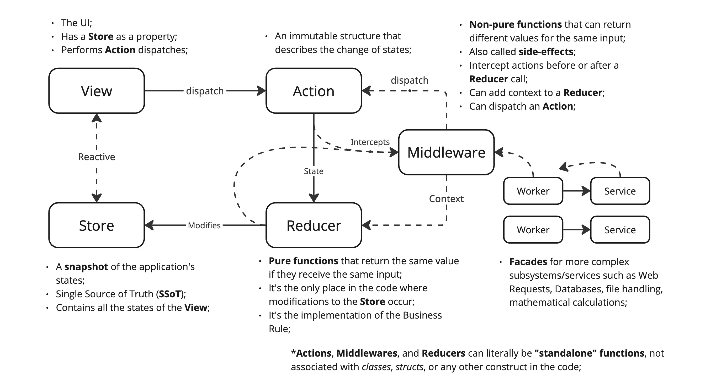

## Description

A comprehensive diagram on how the Redux architecture works and why you might be using it wrong.

> The image above is just a preview of the full diagram.

- You might need to create some boilerplate code like protocols/interfaces, or/and abstract classes before really start your app; 
- `Actions`, `Middlewares`, and `Reducers` can literally be "standalone" functions, not associated with classes, structs, or any other construct in the code;
- **Middlewares** do not change anything on the **Store**. You might want to create a **Proxy** (design pattern) instead of passing the _store_ to the _middleware_;
- **Main Take**: Focus on the **FP** (functional programming) principles when creating your **Reducers**;

## Download
Donwload the full diagram on the following link: [PDF](redux.pdf)
